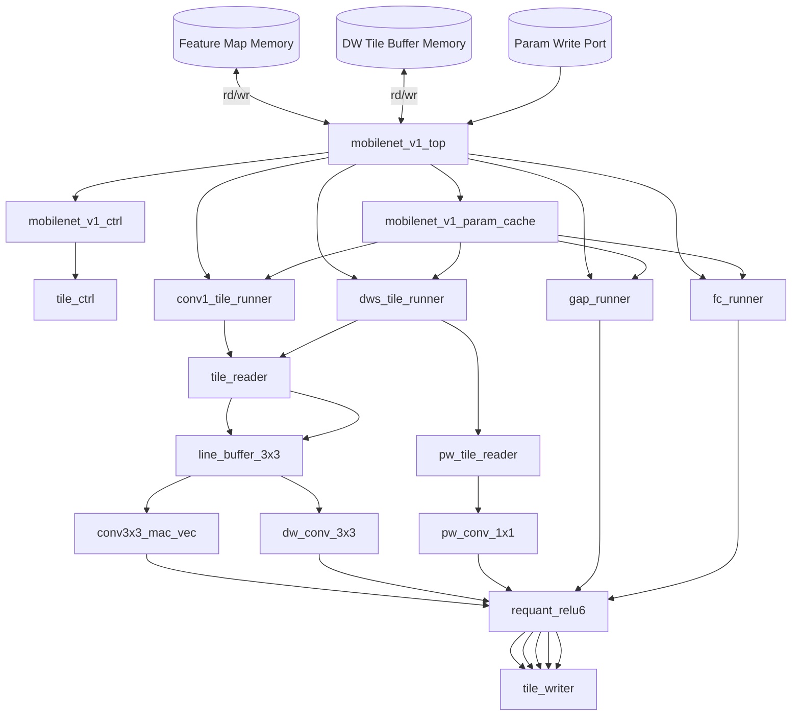
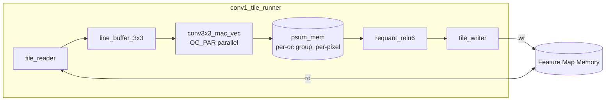
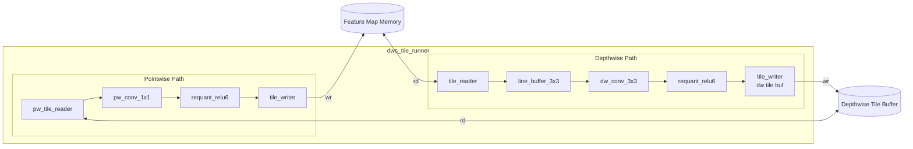
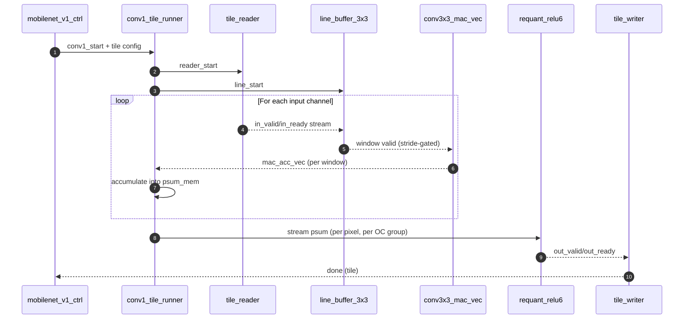
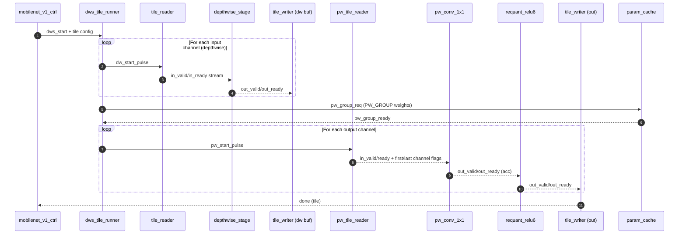

# RTL Architecture (MobileNet v1 int8)

This document provides a block-level diagram of the RTL architecture and a short legend.

## Top-Level Block Diagram



## Dataflow Summary

1. **Top-Level Control**
   - `mobilenet_v1_top` orchestrates the full network: conv1 → 13 depthwise-separable blocks → global average pool → FC.
   - `mobilenet_v1_ctrl` computes layer shapes, stride, and tile coordinates and starts the appropriate runner.

2. **Tiling and Memory**
   - `tile_ctrl` iterates output tiles and computes corresponding input tile ranges (including padding).
   - `tile_reader` streams a tile from planar memory and injects zeros for padding.
   - `tile_writer` writes output tiles back to planar memory.

3. **Conv1 Path (3×3 stride-2)**
   - `tile_reader` → `line_buffer_3x3` → `conv3x3_mac_vec` (parallel OC) → `requant_relu6` → `tile_writer`.
   - Partial sums are accumulated per input channel, then requantized per output channel.

4. **Depthwise + Pointwise Path**
   - **Depthwise**: `tile_reader` → `line_buffer_3x3` → `dw_conv_3x3` → `requant_relu6` → write depthwise tile buffer.
   - **Pointwise**: `pw_tile_reader` streams channel-major DW tiles → `pw_conv_1x1` → `requant_relu6` → `tile_writer`.
   - Pointwise weights are cached in groups via `PW_GROUP` to reduce ROM bandwidth.

5. **Head (GAP + FC)**
   - `gap_runner` sums each channel plane, then requantizes to a single value per channel.
   - `fc_runner` performs a dot product of the GAP vector with FC weights and requantizes outputs.

## Parameter Cache

- `mobilenet_v1_param_cache` stores weights and quant parameters and supports either ROM init (`INIT_*`) or a write port.
- Pointwise weights are prefetched in groups to a small cache, synchronized with `pw_group_req/pw_group_ready`.

## Memory Layout (Assumed)

- Feature maps are **planar**: base + (channel × H×W) + (row × W + col).
- Depthwise tile buffer is **channel-major**: base + (channel × tile_h×tile_w) + (row × tile_w + col).

---

If you prefer an ASCII-only diagram or a more detailed timing/handshake diagram, tell me which format you want.

---

## Detailed Sub-Block Diagrams

### Conv1 Tile Runner (3×3, stride 2)



Notes:
- Reads one **input channel at a time**, accumulates into `psum_mem` across channels.
- Outputs one **OC_PAR group** at a time after accumulation and requantization.
- Output tile is written back to planar feature-map memory.

### Depthwise + Pointwise Tile Runner



Notes:
- Depthwise runs **per input channel**, writes a single-channel output tile to DW buffer.
- Pointwise reads the DW tile **channel-major** and accumulates across channels.
- Pointwise weights are cached in groups (`PW_GROUP`) via the param cache.

---

## Timing / Handshake Views

### Conv1 Tile Runner (per tile)



Key handshakes:
- `tile_reader`: `out_valid/out_ready` backpressure.
- `line_buffer_3x3`: `out_valid/out_ready` per window.
- `requant_relu6`: `in_valid/in_ready` + `out_valid/out_ready`.
- `tile_writer`: single-cycle `start`, then consumes data until tile done.

### Depthwise + Pointwise Tile Runner (per tile)



Key handshakes:
- `pw_group_req/pw_group_ready` gates pointwise runs by cache load.
- `pw_tile_reader` emits `first_in_ch/last_in_ch` for accumulation reset/commit.
- `tile_writer` runs per output channel with a new `start` pulse.

---

## Tile Reader/Writer Cycle-by-Cycle Example

This is a minimal, illustrative example (not tied to a specific layer):
- Tile size: `tile_in_h=2`, `tile_in_w=3` (6 pixels total)
- `out_ready` stays high (no backpressure)
- The memory returns data in the same cycle as `rd_en` for simplicity

### `tile_reader` (zero-padding skipped here; all pixels in-bounds)

```text
Cycle | start | rd_en | rd_addr | out_valid | out_data | note
------+-------+-------+---------+-----------+----------+------------------------------
  0   |   1   |   1   |   a0    |     0     |    -     | capture cfg, issue first read
  1   |   0   |   1   |   a1    |     1     |   d0     | deliver data0, issue read1
  2   |   0   |   1   |   a2    |     1     |   d1     | deliver data1, issue read2
  3   |   0   |   1   |   a3    |     1     |   d2     | deliver data2, issue read3
  4   |   0   |   1   |   a4    |     1     |   d3     | deliver data3, issue read4
  5   |   0   |   1   |   a5    |     1     |   d4     | deliver data4, issue read5
  6   |   0   |   0   |   -     |     1     |   d5     | deliver last data, done=1
```

Notes:
- `rd_en` asserts once per element; `out_valid` lags by one cycle.
- If an element is out-of-bounds, `rd_en` is not asserted and `out_data=0` is produced instead.

### `tile_writer` (same tile, planar writeback)

```text
Cycle | start | in_valid | in_data | wr_en | wr_addr | note
------+-------+----------+---------+-------+---------+------------------------------
  0   |   1   |    1     |   q0    |   1   |   b0    | capture cfg, write first
  1   |   0   |    1     |   q1    |   1   |   b1    | write next
  2   |   0   |    1     |   q2    |   1   |   b2    | write next
  3   |   0   |    1     |   q3    |   1   |   b3    | write next
  4   |   0   |    1     |   q4    |   1   |   b4    | write next
  5   |   0   |    1     |   q5    |   1   |   b5    | write last, done=1
```

Notes:
- `start` can coincide with the first `in_valid`.
- `wr_addr` increments in raster order within the tile (row-major).
